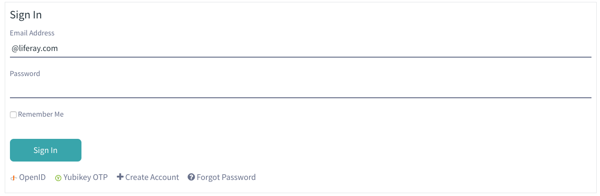

# Yubikey OTP Login

Strong login with Yubikey using Yubico OTP. Get your Yubikey from [Yubico](https://www.yubico.com/products/yubikey-hardware/) 

### Configure Yubico Client
- Get an API key from [https://upgrade.yubico.com/getapikey/](https://upgrade.yubico.com/getapikey/) and make a note of the client id and key.

- Sign in to portal as admin
- Navigate to Control Panel -> Configuration -> System Settings -> Other -> Yubico Client
- Enter client id and key. WSAPI urls are optional

Now the Yubico Client is configured and available for use.

### Enable Yubikey authentication
- Sign in to portal as admin
- Navigate to Control Panel -> Configuration -> Instance Settings -> Authentication -> Yubikey
- Check enabled and click Save

### Register a key with account
- Sign in
- Navigate to My Account -> Yubikey
- Click Add Key
- Enter a name for the key
- Generate a new OTP
- Click Add to register the key

### Login using Yubikey

If you have successfully enabled Yubikey authentication and registered your Yubikey with an account you can use it to login to that account.

Press the OTP generation button on your Yubikey.

